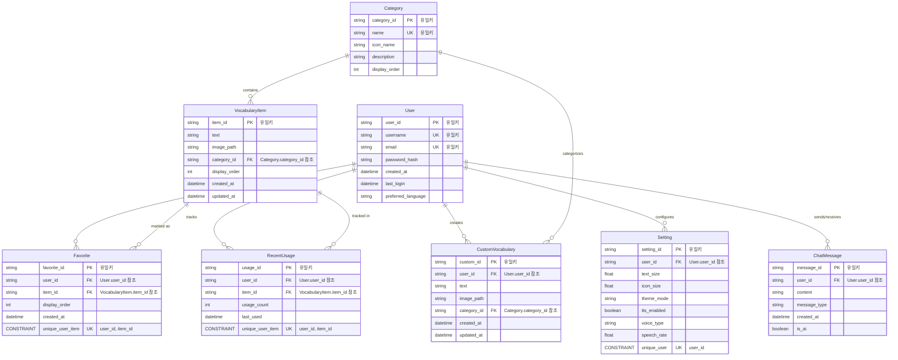

# DB 설계(PRD diagram)

# Connect AAC 어휘 데이터

## 카테고리 정보

| 카테고리 ID | 카테고리 명 | 아이콘 이름 | 설명 |
| --- | --- | --- | --- |
| people | 사람 및 호칭 | people | 다양한 사람과 관계를 표현하는 어휘 |
| emotions | 기분 및 감정 | sentiment_satisfied | 감정과 기분을 표현하는 어휘 |
| health | 건강 및 상태 | healing | 신체 상태와 건강에 관련된 어휘 |
| food | 음식 및 식사 | restaurant | 음식과 식사 관련 어휘 |
| hygiene | 위생 및 의복 | cleaning_services | 위생과 의복에 관련된 어휘 |
| social | 사회성 어휘 | groups | 사회적 상호작용에 필요한 어휘 |
| actions | 행동 및 정도 | directions_run | 행동과 정도를 표현하는 어휘 |
| leisure | 여가 및 놀이 | sports_esports | 여가 활동과 놀이에 관련된 어휘 |
| places | 장소 및 위치 | place | 장소와 위치 관련 어휘 |
| time | 시간 및 때 | access_time | 시간 관련 어휘 |
| nature | 자연 및 동식물 | nature | 자연과 동식물 관련 어휘 |
| education | 학습 및 진로 | school | 학습과 진로 관련 어휘 |
| questions | 의문사 | help_outline | 질문과 의문을 표현하는 어휘 |
| daily | 일상생활 | home | 일상생활 관련 어휘 |
| emergency | 긴급 상황 | warning | 긴급 상황에 필요한 어휘 |

## 어휘 항목 데이터

### 사람 및 호칭 (people)

| 어휘 ID | 텍스트 | 이미지 경로 |
| --- | --- | --- |
| man | 남자 | assets/images/people/man.png |
| me | 나(저요, 제가 할래요) | assets/images/people/me.png |
| family | 가족 | assets/images/people/family.png |
| younger_sibling | 동생 | assets/images/people/younger_sibling.png |
| mother | 엄마 | assets/images/people/mother.png |
| woman | 여자 | assets/images/people/woman.png |
| older_sibling | 오빠/형/언니/누나 | assets/images/people/older_sibling.png |
| doctor | 의사 | assets/images/people/doctor.png |
| teacher | 선생님 | assets/images/people/teacher.png |
| baby | 아기 | assets/images/people/baby.png |
| father | 아빠 | assets/images/people/father.png |
| grandmother | 할머니 | assets/images/people/grandmother.png |
| grandfather | 할아버지 | assets/images/people/grandfather.png |
| friend | 친구 | assets/images/people/friend.png |
| classmate | 반 친구 | assets/images/people/classmate.png |
| neighbor | 이웃 | assets/images/people/neighbor.png |
| stranger | 낯선 사람 | assets/images/people/stranger.png |
| caregiver | 돌봄 선생님 | assets/images/people/caregiver.png |
| therapist | 치료사 | assets/images/people/therapist.png |
| nurse | 간호사 | assets/images/people/nurse.png |

### 기분 및 감정 (emotions)

| 어휘 ID | 텍스트 | 이미지 경로 |
| --- | --- | --- |
| ok | 괜찮다 | assets/images/emotions/ok.png |
| scared | 무섭다 | assets/images/emotions/scared.png |
| difficult | 어렵다 | assets/images/emotions/difficult.png |
| sad | 울다/슬프다 | assets/images/emotions/sad.png |
| pretty | 예쁘다 | assets/images/emotions/pretty.png |
| love | 사랑하다 | assets/images/emotions/love.png |
| easy | 쉽다 | assets/images/emotions/easy.png |
| dislike | 싫다 | assets/images/emotions/dislike.png |
| bored | 심심하다/지루하다 | assets/images/emotions/bored.png |
| want | 하고 싶다 | assets/images/emotions/want.png |
| happy | 행복하다 | assets/images/emotions/happy.png |
| angry | 화나다/기분나쁘다 | assets/images/emotions/angry.png |
| good | 좋다/잘하다 | assets/images/emotions/good.png |
| surprised | 놀라다 | assets/images/emotions/surprised.png |
| confused | 혼란스럽다 | assets/images/emotions/confused.png |
| curious | 궁금하다 | assets/images/emotions/curious.png |
| excited | 신나다 | assets/images/emotions/excited.png |
| proud | 자랑스럽다 | assets/images/emotions/proud.png |
| embarrassed | 창피하다 | assets/images/emotions/embarrassed.png |
| worried | 걱정된다 | assets/images/emotions/worried.png |

### 건강 및 상태 (health)

| 어휘 ID | 텍스트 | 이미지 경로 |
| --- | --- | --- |
| hot | 덥다 | assets/images/health/hot.png |
| cold | 차갑다/춥다 | assets/images/health/cold.png |
| careful | 조심하다 | assets/images/health/careful.png |
| sleepy | 자다/졸리다/눕다 | assets/images/health/sleepy.png |
| magnifier | 확대경 | assets/images/health/magnifier.png |
| tired | 피곤하다/쉬다 | assets/images/health/tired.png |
| glasses | 안경 | assets/images/health/glasses.png |
| sick | 아프다 | assets/images/health/sick.png |
| mask | 미세먼지/마스크/입을 막다 | assets/images/health/mask.png |
| uncomfortable | 불편하다 | assets/images/health/uncomfortable.png |
| medicine | 약 | assets/images/health/medicine.png |
| itchy | 가렵다 | assets/images/health/itchy.png |
| injured | 다치다 | assets/images/health/injured.png |
| burning | 뜨겁다 | assets/images/health/burning.png |
| dizzy | 어지럽다 | assets/images/health/dizzy.png |
| fever | 열이 나다 | assets/images/health/fever.png |
| nausea | 구역질/메스껍다 | assets/images/health/nausea.png |
| headache | 두통/머리 아프다 | assets/images/health/headache.png |
| stomachache | 배 아프다 | assets/images/health/stomachache.png |
| allergy | 알레르기 | assets/images/health/allergy.png |
| wheelchair | 휠체어 | assets/images/health/wheelchair.png |
| cane | 지팡이 | assets/images/health/cane.png |
| healthy | 건강하다 | assets/images/health/healthy.png |

### 음식 및 식사 (food)

| 어휘 ID | 텍스트 | 이미지 경로 |
| --- | --- | --- |
| soup | 국 | assets/images/food/soup.png |
| cup | 컵 | assets/images/food/cup.png |
| fork | 포크 | assets/images/food/fork.png |
| icecream | 아이스크림 | assets/images/food/icecream.png |
| spoon | 숟가락 | assets/images/food/spoon.png |
| fish | 생선 | assets/images/food/fish.png |
| straw | 빨대 | assets/images/food/straw.png |
| bread | 빵 | assets/images/food/bread.png |
| hungry | 배고프다 | assets/images/food/hungry.png |
| rice | 밥 | assets/images/food/rice.png |
| milk | 우유 | assets/images/food/milk.png |
| eat | 먹다/식사/간식 | assets/images/food/eat.png |
| kimchi | 김치/맵다 | assets/images/food/kimchi.png |
| bowl | 그릇 | assets/images/food/bowl.png |
| snack | 과자 | assets/images/food/snack.png |
| meat | 고기 | assets/images/food/meat.png |
| refrigerator | 냉장고 | assets/images/food/refrigerator.png |
| drink | 마시다/목마르다/물 | assets/images/food/drink.png |
| fruit | 과일/사과 | assets/images/food/fruit.png |
| chopsticks | 젓가락 | assets/images/food/chopsticks.png |
| noodles | 면/국수/라면 | assets/images/food/noodles.png |
| egg | 계란 | assets/images/food/egg.png |
| vegetable | 채소 | assets/images/food/vegetable.png |
| banana | 바나나 | assets/images/food/banana.png |
| full | 배부르다 | assets/images/food/full.png |
| chocolate | 초콜릿 | assets/images/food/chocolate.png |
| juice | 주스 | assets/images/food/juice.png |
| yogurt | 요구르트 | assets/images/food/yogurt.png |
| pizza | 피자 | assets/images/food/pizza.png |
| chicken | 치킨 | assets/images/food/chicken.png |

### 위생 및 의복 (hygiene)

| 어휘 ID | 텍스트 | 이미지 경로 |
| --- | --- | --- |
| diaper | 기저귀/생리대 | assets/images/hygiene/diaper.png |
| toothpaste | 치약 | assets/images/hygiene/toothpaste.png |
| wet | 젖다 | assets/images/hygiene/wet.png |
| tissue | 휴지 | assets/images/hygiene/tissue.png |
| clean | 청소하다 | assets/images/hygiene/clean.png |
| toilet | 화장실/소변보다 | assets/images/hygiene/toilet.png |
| pants | 아래옷을 입다/바지/치마/팬티 | assets/images/hygiene/pants.png |
| take_off_pants | 아래옷을 벗다 | assets/images/hygiene/take_off_pants.png |
| wash_face | 세수하다 | assets/images/hygiene/wash_face.png |
| wear_shoes | (신발,양말을) 신다 | assets/images/hygiene/wear_shoes.png |
| towel | 수건/수건으로 닦다 | assets/images/hygiene/towel.png |
| take_off_shoes | (신발,양말을) 벗다 | assets/images/hygiene/take_off_shoes.png |
| soap | 비누/씻다 | assets/images/hygiene/soap.png |
| shoes | 신발 | assets/images/hygiene/shoes.png |
| take_out | 빼다 | assets/images/hygiene/take_out.png |
| wear_top | 윗옷을 입다 | assets/images/hygiene/wear_top.png |
| take_off_top | 윗옷을 벗다/가방을 벗다 | assets/images/hygiene/take_off_top.png |
| top | 윗옷 | assets/images/hygiene/top.png |
| face | 얼굴 | assets/images/hygiene/face.png |
| bath | 목욕하다 | assets/images/hygiene/bath.png |
| hat | 모자/모자를 쓰다 | assets/images/hygiene/hat.png |
| comb_hair | 머리빗다 | assets/images/hygiene/comb_hair.png |
| wash_hair | 머리감다 | assets/images/hygiene/wash_hair.png |
| poop | 대변보다 | assets/images/hygiene/poop.png |
| clean_adj | 깨끗하다 | assets/images/hygiene/clean_adj.png |
| wear_accessory | 끼다 | assets/images/hygiene/wear_accessory.png |
| mop | 걸레/걸레로 닦다 | assets/images/hygiene/mop.png |
| toothbrush | 칫솔/양치질하다 | assets/images/hygiene/toothbrush.png |
| socks | 양말 | assets/images/hygiene/socks.png |
| jacket | 겉옷/코트 | assets/images/hygiene/jacket.png |
| dirty | 더럽다 | assets/images/hygiene/dirty.png |
| handkerchief | 손수건 | assets/images/hygiene/handkerchief.png |
| haircut | 머리 자르다 | assets/images/hygiene/haircut.png |
| shampoo | 샴푸 | assets/images/hygiene/shampoo.png |

### 사회성 어휘 (social)

| 어휘 ID | 텍스트 | 이미지 경로 |
| --- | --- | --- |
| thanks | 고맙다 | assets/images/social/thanks.png |
| joke | 농담(농담이에요)/장난(장난이에요) | assets/images/social/joke.png |
| together | 다 함께 | assets/images/social/together.png |
| money | 돈/사다 | assets/images/social/money.png |
| help | 돕다 | assets/images/social/help.png |
| yes | 예(응,그래) | assets/images/social/yes.png |
| sorry | 미안하다 | assets/images/social/sorry.png |
| no | 아니요 | assets/images/social/no.png |
| hello | 안녕(안녕하세요, 안녕히 계세요) | assets/images/social/hello.png |
| not_allowed | 안 돼 | assets/images/social/not_allowed.png |
| with | 함께/함께하다 | assets/images/social/with.png |
| excuse_me | 저기요(부르는말) | assets/images/social/excuse_me.png |
| tablet | 의사소통기기(태블릿PC) | assets/images/social/tablet.png |
| congratulate | 축하하다 | assets/images/social/congratulate.png |
| please | 제발/부탁해요 | assets/images/social/please.png |
| welcome | 환영합니다 | assets/images/social/welcome.png |
| share | 나눠쓰다/공유하다 | assets/images/social/share.png |
| polite | 예의바르다 | assets/images/social/polite.png |
| greet | 인사하다 | assets/images/social/greet.png |
| promise | 약속하다 | assets/images/social/promise.png |
| secret | 비밀 | assets/images/social/secret.png |
| introduce | 소개하다 | assets/images/social/introduce.png |
| participate | 참여하다 | assets/images/social/participate.png |
| cooperate | 협력하다 | assets/images/social/cooperate.png |
| gift | 선물 | assets/images/social/gift.png |

### 행동 및 정도 (actions)

| 어휘 ID | 텍스트 | 이미지 경로 |
| --- | --- | --- |
| same | 같다 | assets/images/actions/same.png |
| not_exist | 없다 | assets/images/actions/not_exist.png |
| come | 오다 | assets/images/actions/come.png |
| fast | 빠르다/빨리 | assets/images/actions/fast.png |
| look | 보다 | assets/images/actions/look.png |
| stand | 서다(일어서다)/스탠더(기립훈련기) | assets/images/actions/stand.png |
| start | 시작하다 | assets/images/actions/start.png |
| think | 생각하다 | assets/images/actions/think.png |
| open_door | 문을 열다 | assets/images/actions/open_door.png |
| receive | 받다 | assets/images/actions/receive.png |
| hug | 안다(안아주다) | assets/images/actions/hug.png |
| big | 크다/넓다 | assets/images/actions/big.png |
| exist | 있다 | assets/images/actions/exist.png |
| wait | 잠깐만(잠깐 기다려, 이따가)/다음에 | assets/images/actions/wait.png |
| give | 주다 | assets/images/actions/give.png |
| close_window | 창문을 닫다 | assets/images/actions/close_window.png |
| open_window | 창문을 열다 | assets/images/actions/open_window.png |
| small | 작다/적다(조금) | assets/images/actions/small.png |
| organize | 정리하다/준비하다 | assets/images/actions/organize.png |
| quiet | 조용히하다(조용히) | assets/images/actions/quiet.png |
| more | 좀 더 | assets/images/actions/more.png |
| please_give | 주세요 | assets/images/actions/please_give.png |
| turn_on | 켜다/빛/해 | assets/images/actions/turn_on.png |
| know | 알다 | assets/images/actions/know.png |
| sit | 앉다/의자 | assets/images/actions/sit.png |
| close_door | 문을 닫다 | assets/images/actions/close_door.png |
| finish | 끝나다/다했다 | assets/images/actions/finish.png |
| listen | 듣다(노래,음악을 듣다) | assets/images/actions/listen.png |
| stop | 그만하다(멈추다) | assets/images/actions/stop.png |
| share_out | 나누다(나눠 주다) | assets/images/actions/share_out.png |
| walk | 걷다 | assets/images/actions/walk.png |
| turn_off | 끄다 | assets/images/actions/turn_off.png |
| put_in | 넣다/담다 | assets/images/actions/put_in.png |
| slow | 느리다/천천히 | assets/images/actions/slow.png |
| different | 다르다 | assets/images/actions/different.png |
| go | 가다 | assets/images/actions/go.png |
| wait_v | 기다리다 | assets/images/actions/wait_v.png |
| take_out_v | 꺼내다 | assets/images/actions/take_out_v.png |
| other_please | 다른 것 주세요 | assets/images/actions/other_please.png |
| again | 다시 | assets/images/actions/again.png |
| throw | 던지다 | assets/images/actions/throw.png |
| make | 만들다 | assets/images/actions/make.png |
| talk | 말하다 | assets/images/actions/talk.png |
| correct | 맞다(*때리다의 반대말) | assets/images/actions/correct.png |
| hit | 때리다/두드리다(치다) | assets/images/actions/hit.png |
| dont_know | 모르다 | assets/images/actions/dont_know.png |
| get_off | 내리다(차에서) | assets/images/actions/get_off.png |
| smell | 냄새 맡다 | assets/images/actions/smell.png |
| ride | (차에)타다 | assets/images/actions/ride.png |
| push | 밀다 | assets/images/actions/push.png |
| pull | 당기다 | assets/images/actions/pull.png |
| touch | 만지다 | assets/images/actions/touch.png |
| bring | 가져오다 | assets/images/actions/bring.png |
| find | 찾다 | assets/images/actions/find.png |
| count | 세다 | assets/images/actions/count.png |
| fix | 고치다 | assets/images/actions/fix.png |
| try | 시도하다 | assets/images/actions/try.png |

### 여가 및 놀이 (leisure)

| 어휘 ID | 텍스트 | 이미지 경로 |
| --- | --- | --- |
| play | 놀다 | assets/images/leisure/play.png |
| song | 노래/노래하다/음악 | assets/images/leisure/song.png |
| swim | 수영하다 | assets/images/leisure/swim.png |
| tv | TV/TV를 보다 | assets/images/leisure/tv.png |
| smartphone | 휴대전화/스마트폰 | assets/images/leisure/smartphone.png |
| dance | 춤/춤추다 | assets/images/leisure/dance.png |
| computer | 컴퓨터/컴퓨터하다 | assets/images/leisure/computer.png |
| toy | 장난감 | assets/images/leisure/toy.png |
| game | 게임 | assets/images/leisure/game.png |
| ball | 공놀이 | assets/images/leisure/ball.png |
| paint | 그림 그리기 | assets/images/leisure/paint.png |
| bike | 자전거 타기 | assets/images/leisure/bike.png |
| park | 공원 놀이 | assets/images/leisure/park.png |
| read | 책 읽기 | assets/images/leisure/read.png |
| run | 달리기 | assets/images/leisure/run.png |
| jump | 점프하기 | assets/images/leisure/jump.png |
| slide | 미끄럼틀 | assets/images/leisure/slide.png |
| swing | 그네 | assets/images/leisure/swing.png |
| sandbox | 모래놀이 | assets/images/leisure/sandbox.png |
| climb | 오르기/등반 | assets/images/leisure/climb.png |
| blocks | 블록놀이 | assets/images/leisure/blocks.png |
| puzzle | 퍼즐 | assets/images/leisure/puzzle.png |
| doll | 인형 | assets/images/leisure/doll.png |
| photograph | 사진 찍기 | assets/images/leisure/photograph.png |
| instrument | 악기 연주 | assets/images/leisure/instrument.png |

### 장소 및 위치 (places)

| 어휘 ID | 텍스트 | 이미지 경로 |
| --- | --- | --- |
| classroom | 교실 | assets/images/places/classroom.png |
| car | 자동차 | assets/images/places/car.png |
| window | 창문 | assets/images/places/window.png |
| school | 학교 | assets/images/places/school.png |
| inside | 안(안으로) | assets/images/places/inside.png |
| down | 아래/내려가다 | assets/images/places/down.png |
| bus | 버스 | assets/images/places/bus.png |
| outside | 바깥(밖으로) | assets/images/places/outside.png |
| hospital | 병원 | assets/images/places/hospital.png |
| kitchen | 부엌(주방)/식당 | assets/images/places/kitchen.png |
| up | 위/올라가다 | assets/images/places/up.png |
| elevator | 엘리베이터 | assets/images/places/elevator.png |
| left | 왼쪽 | assets/images/places/left.png |
| right | 오른쪽 | assets/images/places/right.png |
| escalator | 에스컬레이터 | assets/images/places/escalator.png |
| door | 문 | assets/images/places/door.png |
| train | 기차/지하철(전철) | assets/images/places/train.png |
| stairs | 계단 | assets/images/places/stairs.png |
| home | 집 | assets/images/places/home.png |
| store | 가게/마트 | assets/images/places/store.png |
| park | 공원 | assets/images/places/park.png |
| restaurant | 식당 | assets/images/places/restaurant.png |
| bathroom | 화장실 | assets/images/places/bathroom.png |
| bedroom | 침실 | assets/images/places/bedroom.png |
| playground | 놀이터 | assets/images/places/playground.png |
| library | 도서관 | assets/images/places/library.png |
| theater | 영화관/극장 | assets/images/places/theater.png |
| gym | 체육관 | assets/images/places/gym.png |
| cafe | 카페 | assets/images/places/cafe.png |
| front | 앞 | assets/images/places/front.png |
| back | 뒤 | assets/images/places/back.png |
| near | 가까이 | assets/images/places/near.png |
| far | 멀리 | assets/images/places/far.png |
| center | 가운데 | assets/images/places/center.png |

### 시간 및 때 (time)

| 어휘 ID | 텍스트 | 이미지 경로 |
| --- | --- | --- |
| day | 낮/아침 | assets/images/time/day.png |
| tomorrow | 내일 | assets/images/time/tomorrow.png |
| yesterday | 어제 | assets/images/time/yesterday.png |
| birthday | 생일/생일파티 | assets/images/time/birthday.png |
| night | 밤 | assets/images/time/night.png |
| holiday | 휴일 | assets/images/time/holiday.png |
| now | 지금/오늘 | assets/images/time/now.png |
| morning | 아침 | assets/images/time/morning.png |
| afternoon | 오후 | assets/images/time/afternoon.png |
| evening | 저녁 | assets/images/time/evening.png |
| weekend | 주말 | assets/images/time/weekend.png |
| weekday | 평일 | assets/images/time/weekday.png |
| time_to_sleep | 잘 시간 | assets/images/time/time_to_sleep.png |
| time_to_eat | 식사 시간 | assets/images/time/time_to_eat.png |
| time_to_play | 놀이 시간 | assets/images/time/time_to_play.png |
| time_to_study | 공부 시간 | assets/images/time/time_to_study.png |
| season | 계절 | assets/images/time/season.png |
| spring | 봄 | assets/images/time/spring.png |
| summer | 여름 | assets/images/time/summer.png |
| fall | 가을 | assets/images/time/fall.png |
| winter | 겨울 | assets/images/time/winter.png |
| month | 달(월) | assets/images/time/month.png |
| year | 년 | assets/images/time/year.png |
| wait_moment | 잠시만 | assets/images/time/wait_moment.png |
| soon | 곧 | assets/images/time/soon.png |
| later | 나중에 | assets/images/time/later.png |
| always | 항상 | assets/images/time/always.png |
| never | 절대로 | assets/images/time/never.png |

### 자연 및 동식물 (nature)

| 어휘 ID | 텍스트 | 이미지 경로 |
| --- | --- | --- |
| tree | 나무 | assets/images/nature/tree.png |
| flower | 꽃 | assets/images/nature/flower.png |
| snow | 눈(눈이 오다) | assets/images/nature/snow.png |
| moon | 달(달이 뜨다) | assets/images/nature/moon.png |
| mountain | 산 | assets/images/nature/mountain.png |
| fire | 불 | assets/images/nature/fire.png |
| sea | 바다 | assets/images/nature/sea.png |
| sky | 하늘 | assets/images/nature/sky.png |
| rain | 비(비가 오다) | assets/images/nature/rain.png |
| sun | 해/태양 | assets/images/nature/sun.png |
| cloud | 구름 | assets/images/nature/cloud.png |
| wind | 바람 | assets/images/nature/wind.png |
| star | 별 | assets/images/nature/star.png |
| water | 물 | assets/images/nature/water.png |
| leaf | 잎 | assets/images/nature/leaf.png |
| grass | 풀/잔디 | assets/images/nature/grass.png |
| dog | 개/강아지 | assets/images/nature/dog.png |
| cat | 고양이 | assets/images/nature/cat.png |
| bird | 새/새들 | assets/images/nature/bird.png |
| fish | 물고기 | assets/images/nature/fish.png |
| butterfly | 나비 | assets/images/nature/butterfly.png |
| bug | 벌레 | assets/images/nature/bug.png |
| animal | 동물 | assets/images/nature/animal.png |
| plant | 식물 | assets/images/nature/plant.png |
| river | 강 | assets/images/nature/river.png |
| forest | 숲 | assets/images/nature/forest.png |
| earth | 지구 | assets/images/nature/earth.png |
| rainbow | 무지개 | assets/images/nature/rainbow.png |
| stone | 돌/바위 | assets/images/nature/stone.png |
| hot_weather | 더운 날씨 | assets/images/nature/hot_weather.png |
| cold_weather | 추운 날씨 | assets/images/nature/cold_weather.png |

### 학습 및 진로 (education)

| 어휘 ID | 텍스트 | 이미지 경로 |
| --- | --- | --- |
| backpack | 가방/가방을 메다 | assets/images/education/backpack.png |
| pen | 연필/볼펜/펜/글씨를 쓰다 | assets/images/education/pen.png |
| photo | 사진(사진을 찍다)/그림(그림을 그리다) | assets/images/education/photo.png |
| braille | 점필/점자를 찍다 | assets/images/education/braille.png |
| book | 책/책을 펴다 | assets/images/education/book.png |
| study | 공부하다 | assets/images/education/study.png |
| homework | 숙제 | assets/images/education/homework.png |
| test | 시험 | assets/images/education/test.png |
| class | 수업 | assets/images/education/class.png |
| teacher | 선생님 | assets/images/education/teacher.png |
| grade | 학년 | assets/images/education/grade.png |
| classmate | 친구/반 친구 | assets/images/education/classmate.png |
| question | 질문 | assets/images/education/question.png |
| answer | 대답 | assets/images/education/answer.png |
| read | 읽다 | assets/images/education/read.png |
| write | 쓰다 | assets/images/education/write.png |
| draw | 그리다 | assets/images/education/draw.png |
| eraser | 지우개 | assets/images/education/eraser.png |
| scissors | 가위 | assets/images/education/scissors.png |
| glue | 풀/접착제 | assets/images/education/glue.png |
| calculator | 계산기 | assets/images/education/calculator.png |
| notebook | 공책 | assets/images/education/notebook.png |
| ruler | 자 | assets/images/education/ruler.png |
| library | 도서관 | assets/images/education/library.png |
| presentation | 발표 | assets/images/education/presentation.png |

### 의문사 (questions)

| 어휘 ID | 텍스트 | 이미지 경로 |
| --- | --- | --- |
| who | 누가 | assets/images/questions/who.png |
| when | 언제 | assets/images/questions/when.png |
| where | 어디서 | assets/images/questions/where.png |
| what | 무엇을 | assets/images/questions/what.png |
| how | 어떻게 | assets/images/questions/how.png |
| why | 왜 | assets/images/questions/why.png |
| name | 이름 | assets/images/questions/name.png |
| which | 어느 것 | assets/images/questions/which.png |
| whose | 누구의 | assets/images/questions/whose.png |
| question | 질문 | assets/images/questions/question.png |
| answer | 대답 | assets/images/questions/answer.png |
| how_many | 몇 개 | assets/images/questions/how_many.png |
| how_much | 얼마 | assets/images/questions/how_much.png |

### 일상생활 (daily)

| 어휘 ID | 텍스트 | 이미지 경로 |
| --- | --- | --- |
| wake_up | 일어나다 | assets/images/daily/wake_up.png |
| brush_teeth | 양치질하다 | assets/images/daily/brush_teeth.png |
| eat_breakfast | 아침 먹다 | assets/images/daily/eat_breakfast.png |
| go_to_school | 학교 가다 | assets/images/daily/go_to_school.png |
| study | 공부하다 | assets/images/daily/study.png |
| lunch | 점심 먹다 | assets/images/daily/lunch.png |
| go_home | 집에 가다 | assets/images/daily/go_home.png |
| dinner | 저녁 먹다 | assets/images/daily/dinner.png |
| shower | 샤워하다 | assets/images/daily/shower.png |
| sleep | 자다 | assets/images/daily/sleep.png |
| dress | 옷 입다 | assets/images/daily/dress.png |
| undress | 옷 벗다 | assets/images/daily/undress.png |
| wash_hands | 손 씻다 | assets/images/daily/wash_hands.png |
| watch_tv | TV 보다 | assets/images/daily/watch_tv.png |
| play_game | 게임하다 | assets/images/daily/play_game.png |
| use_phone | 핸드폰 사용하다 | assets/images/daily/use_phone.png |
| visit | 방문하다 | assets/images/daily/visit.png |
| shopping | 쇼핑하다 | assets/images/daily/shopping.png |
| clean | 청소하다 | assets/images/daily/clean.png |
| laundry | 빨래하다 | assets/images/daily/laundry.png |
| exercise | 운동하다 | assets/images/daily/exercise.png |
| schedule | 일정/계획 | assets/images/daily/schedule.png |
| rest | 쉬다 | assets/images/daily/rest.png |
| hobby | 취미 | assets/images/daily/hobby.png |
| weekend | 주말 | assets/images/daily/weekend.png |

### 긴급 상황 (emergency)

| 어휘 ID | 텍스트 | 이미지 경로 |
| --- | --- | --- |
| help | 도와주세요 | assets/images/emergency/help.png |
| pain | 아파요 | assets/images/emergency/pain.png |
| danger | 위험해요 | assets/images/emergency/danger.png |
| ambulance | 구급차 | assets/images/emergency/ambulance.png |
| fire_truck | 소방차 | assets/images/emergency/fire_truck.png |
| police | 경찰 | assets/images/emergency/police.png |
| emergency | 응급 상황 | assets/images/emergency/emergency.png |
| hospital | 병원 | assets/images/emergency/hospital.png |
| medicine | 약 | assets/images/emergency/medicine.png |
| allergy | 알레르기 | assets/images/emergency/allergy.png |
| accident | 사고 | assets/images/emergency/accident.png |
| call | 전화하다 | assets/images/emergency/call.png |
| doctor | 의사 | assets/images/emergency/doctor.png |
| injury | 부상 | assets/images/emergency/injury.png |
| fall | 넘어지다 | assets/images/emergency/fall.png |
| lost | 길을 잃었어요 | assets/images/emergency/lost.png |
| too_hot | 너무 더워요 | assets/images/emergency/too_hot.png |
| too_cold | 너무 추워요 | assets/images/emergency/too_cold.png |
| cant_breathe | 숨을 못 쉬어요 | assets/images/emergency/cant_breathe.png |
| scared | 무서워요 | assets/images/emergency/scared.png |