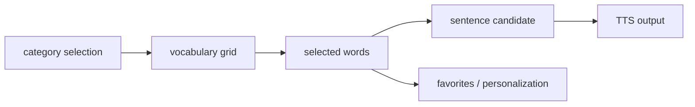

# Connect-AAC

자폐 및 지적장애인을 위한 AI 기반 보완대체의사소통(AAC) 모바일 애플리케이션입니다.

> Portfolio position: accessibility-focused mobile UI, AAC interaction flow, AI-assisted sentence recommendation.

## Why This Problem

AAC 사용자는 말을 대신할 표현을 빠르게 선택해야 하지만, 실제 대화 상황에서는 탐색 단계가 길어지거나 표현 후보가 부족해질 수 있습니다. 특히 모바일 화면에서는 버튼 크기, 대비, 탐색 깊이, TTS 피드백, 자주 쓰는 표현 접근성이 사용자 경험을 크게 좌우합니다.

Connect-AAC는 기능을 많이 넣는 앱보다 **대화 중 사용자가 덜 헤매고, 더 빠르게 표현 후보를 만들 수 있는 흐름**을 목표로 했습니다.

## Method



## What We Built

- Flutter 기반 AAC mobile UI
- 카테고리별 어휘 선택 흐름
- 한국형 손담 어휘 체계 기반 vocabulary structure
- 즐겨찾기와 개인화 설정
- 선택 단어 기반 AI sentence recommendation concept
- TTS(Text-to-Speech) output flow
- Flask/AWS/PostgreSQL 기반 backend concept

## My Role

팀 프로젝트에서 Flutter 기반 프론트엔드와 접근성 중심 UI를 담당했습니다. 큰 버튼, 높은 대비, 쉬운 탐색, AAC 입력 흐름, TTS 사용 경험을 중심으로 구현했습니다.

## Engineering Decisions

| Decision | Alternatives Considered | Why | Tradeoff |
| --- | --- | --- | --- |
| 큰 touch target과 높은 대비 우선 | 더 많은 정보를 한 화면에 압축 | AAC는 빠른 선택과 오입력 방지가 중요하다고 판단 | 화면당 정보량은 줄어듦 |
| category -> vocabulary -> sentence 흐름 | 자유 입력 중심 UI | 초기 사용자가 선택 기반으로 표현을 만들기 쉽고 TTS로 닫을 수 있음 | 고급 사용자의 빠른 자유 입력은 별도 설계 필요 |
| 즐겨찾기/개인화 포함 | 정적 어휘만 제공 | 반복 표현 접근 시간을 줄이는 것이 실제 사용성에 직접 연결됨 | 상태 관리와 저장소 관리가 필요 |
| AI 추천은 보조 후보로 제한 | AI가 문장을 자동 결정 | AAC에서는 사용자의 의도와 통제권이 중요하므로 추천은 선택 가능한 후보여야 함 | 추천 품질 평가가 추가로 필요 |

## AI-Assisted Engineering Record

AI는 접근성 체크리스트, AAC interaction flow, README 구조를 점검하는 데 사용했습니다. AI가 제안한 “자동 대화 생성” 방향은 사용자의 의도 통제권을 약하게 만들 수 있어 수용하지 않았고, 선택 단어를 기반으로 한 **보조 sentence candidate**로 범위를 제한했습니다.

공개 포트폴리오에서는 backend/AI 모델 성능을 과장하지 않습니다. 현재 README는 팀 역할, Flutter UI 구현, 접근성 판단, AAC flow를 증거로 제시하고, 모델 품질 평가는 future validation으로 남깁니다.

## Stack

| Area | Stack |
| --- | --- |
| Mobile | Flutter, Dart |
| State/local data | Provider, Shared Preferences |
| Backend | Flask, AWS, PostgreSQL |
| AI | Hugging Face Transformers, fine-tuning concept |
| Accessibility | High contrast UI, large touch targets, TTS |

## Main Features

| Feature | Description |
| --- | --- |
| AAC input | 카테고리별 어휘 선택과 표현 조합 |
| Korean vocabulary | 한국형 손담 어휘 체계 기반 단어 구성 |
| AI recommendation | 선택 단어와 문맥 기반 문장 후보 생성 concept |
| TTS | 선택 단어/생성 문장을 음성으로 출력 |
| Personalization | 테마, 음성 설정, 즐겨찾기, 난이도 조정 |
| Accessible UI | 큰 버튼, 선명한 색 대비, 충분한 폰트 크기 |

## Run

```bash
flutter pub get
flutter run
```

Backend/API integration values should be configured locally and not committed.

## Repository Structure

```text
lib/
  data/       static data and sources
  models/     data models
  providers/  state management
  screens/    app screens
  services/   backend/API and TTS services
  utils/      helpers
  widgets/    reusable UI components
```

## Validation Evidence

| Area | Evidence |
| --- | --- |
| Frontend role | Flutter AAC UI implemented |
| Accessibility | large buttons, high contrast, readable type choices |
| AAC flow | category -> vocabulary -> sentence/TTS path documented |
| AI feature | sentence recommendation treated as assistive candidate, not autonomous output |
| Team scope | frontend, backend, and AI recommendation roles separated |

## Known Limits

- No public screenshot is included yet because public-safe app states and consent/privacy should be checked first.
- AI recommendation quality is not claimed without task-specific evaluation.
- Backend/API credentials and integration values must stay local and out of git.
- Future proof should add sanitized screenshots, accessibility review notes, and simple task-completion timing checks.

## License

MIT License.
